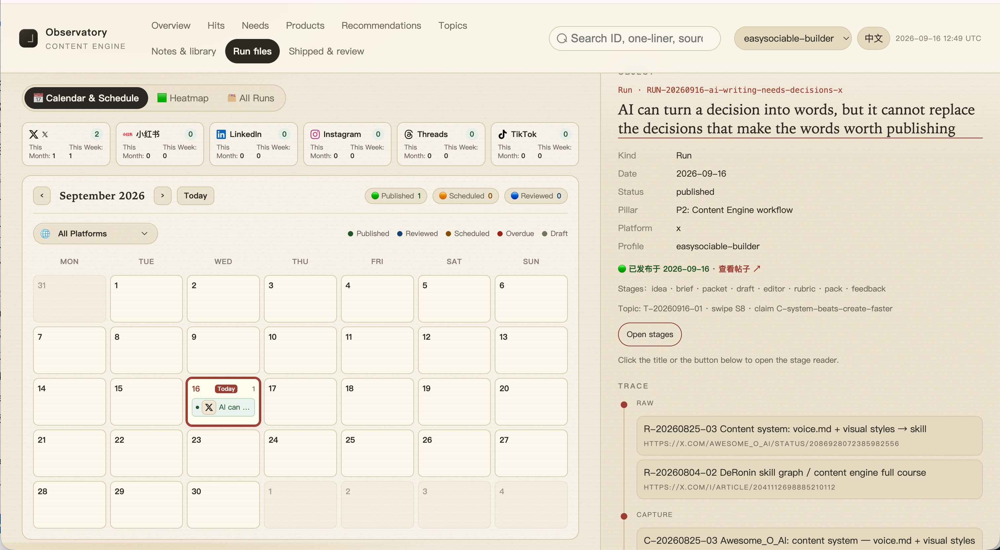

# Content Engine

Content Engine is a local-first content system for AI-native creators.

It helps an Agent turn real audience signals into a repeatable publishing
workflow:

**Profile → Needs → Topics → Runs → feedback**

The system is intentionally local. Your profile, audience language, decisions,
drafts, and feedback live in Markdown files that you control. The Agent reads
the engine rules and writes to this folder; you do not need to learn the
folder structure before getting started.



## Install and start

There are only three things to do.

### 1. Clone the Content Engine

```bash
git clone https://github.com/murphywuwu/content-engine.git
cd content-engine
```

This folder is your local Content Engine. Keep it private if it contains your
profile, audience research, drafts, or other private knowledge.

### 2. Install the EasySociable CLI and `easysociable-content` skill

Install the EasySociable CLI first, then install the Content skill:

```bash
curl -fsSL https://easysociable.com/install.sh | bash
easysociable install --skills content --yes
```

The first command installs the `easysociable` tool. The second installs the
`easysociable-content` skill for your Agent. The skill explains how to operate
the engine; `CLAUDE.md` in this folder remains the source of truth for this
specific engine.

You do not need to install Node.js packages, Python packages, a database, or a
separate workbench. The Agent handles the workbench when it is useful.

### 3. Tell your Agent what you want to do

Open the cloned folder in your Agent and follow the steps below.

## Build your account, step by step

You do not operate the workbench directly. You tell your Agent what you want in
one short phrase, and the workbench fills in as a read-only mirror of your
progress. Each step below is the phrase to say, what to expect, and which
workbench tab lights up. Screenshots live in `assets/` — capture your own as
you go.

### Step 1 — Set up your creator profile

Say `interview me`.

The Agent interviews you one dimension at a time — identity, experience, voice,
values, boundaries, audience — and saves each answer before asking the next. No
long prompt needed. It will not invent biography, values, or boundaries; where
it has nothing from you, it writes an empty starter and asks.

Workbench: your profile appears in the selector at the top right of the
**Overview** tab.


### Step 2 — Set up your keywords

Say `set up my keywords`.

Keywords are how you go looking for real audience language when you do not have
it yet. The Agent proposes candidates from your profile (audience and pillars),
and you keep the ones that fit. Each keyword carries an intent:

- **pain** — phrases your audience uses when describing a problem
- **product** — terms for a product or category people discuss
- **question** — questions people ask about the topic

Pain keywords are searched on real platforms in the next step; product and
question keywords can carry an optional volume note if you have one.

Keywords live in your profile (`keywords.md`), so there is no separate workbench
tab yet — you will see the payoff in the Hits and Needs tabs after you scan.

If you already have real quotes, you can skip this step and record them directly
in Step 3.

### Step 3 — Collect real audience needs

Say `scan keywords` to research your pain keywords, or `record these audience
needs: <paste real quotes>` to log language you already have.

Scanning searches real platforms and stages results in Hits. This needs the
`agent-reach` skill, which lets your Agent reach Xiaohongshu, X, Reddit, and
others — install it once from
[Agent Reach](https://github.com/Panniantong/Agent-Reach)
([install guide](https://raw.githubusercontent.com/Panniantong/agent-reach/main/docs/install.md)).
The Agent only writes verbatim quotes into Needs after you confirm. Needs are
evidence, not rewritten ideas — it will not turn a headline, product claim, or
imagined pain into a fake quote.

Workbench: the **Needs** and **Hits** tabs.


### Step 4 — Deconstruct a viral post

Say `capture this` and paste the link or structure of a post that worked.

Use this to break down someone else's hit: the Agent captures the source and
its structure so you can reuse the pattern later. A capture is craft reference,
not your own audience demand and not a finished idea — it stays a capture until
you decide otherwise. Do this whenever you see a post worth learning from.

Workbench: the **Notes & library** tab.


### Step 5 — Turn needs into topics

Say `scan needs for topics`.

The Agent reviews your captured Needs and proposes up to five Topics. Each Topic
comes with a judgment card: who it is for, the core point of view, the belief it
aims to change, and the evidence gap. Review and choose before producing. A
Topic is a decision about what is worth saying, not yet a platform draft.

Workbench: the **Topics** tab.


### Step 6 — Open a run and produce content

Say `open a run from T-xxx` (a topic id).

The Agent asks which platform to use first, then creates one run per platform
and guides you through the draft and review stages. A multi-platform request
becomes separate runs, because each platform has different craft rules.

Workbench: the **Run files** tab.


### Step 7 — Publish and review

Say `record this published post and its feedback: <URL / results>`.

The Agent links the post to its run and proposes what reusable learning to
update, without inventing metrics. This closes the loop so the next decision is
better informed — not so that one result is treated as proof for every related
Topic.

Workbench: the **Shipped & review** tab.


## The operating model

The engine keeps five decisions separate:

1. **Profile** — who is speaking and what they can credibly say.
2. **Needs** — what the audience actually said or repeatedly showed.
3. **Topics** — which opportunity deserves a clear point of view.
4. **Runs** — how one Topic becomes content for one platform.
5. **Feedback** — what happened after publishing and what should be learned.

Keywords (Step 2) are how you find audience language, and deconstructing
others' posts (Step 4) feeds a reusable craft library. Both are inputs that
inform Topics and Runs, not decisions themselves.

This separation is the reason the Agent asks questions before writing. It
prevents a plausible draft from being mistaken for evidence, strategy, or
published learning.

## Core and private vault

By default, this folder is both the engine core and your private vault:
`engine.json` uses `"vault_root": "."`.

| Part | Contains | Update policy |
| --- | --- | --- |
| Core | `CLAUDE.md`, rules, templates, indexes, and workbench code | Update from this repository |
| Vault | Your profile, Needs, captures & library, Topics, Runs, and published records | Keep private and back up |

If you want reusable engine rules separate from private data, point
`vault_root` in `engine.json` to another directory. See
[LAYOUT.md](./LAYOUT.md).

## If you already have an engine folder

If an existing folder contains both rules and private data, split it with:

```bash
python3 scripts/migrate-split-vault.py \
  --engine "/path/to/Content Engine" \
  --yes
```

## License

MIT — see [LICENSE](./LICENSE).
