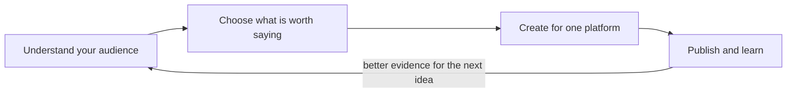
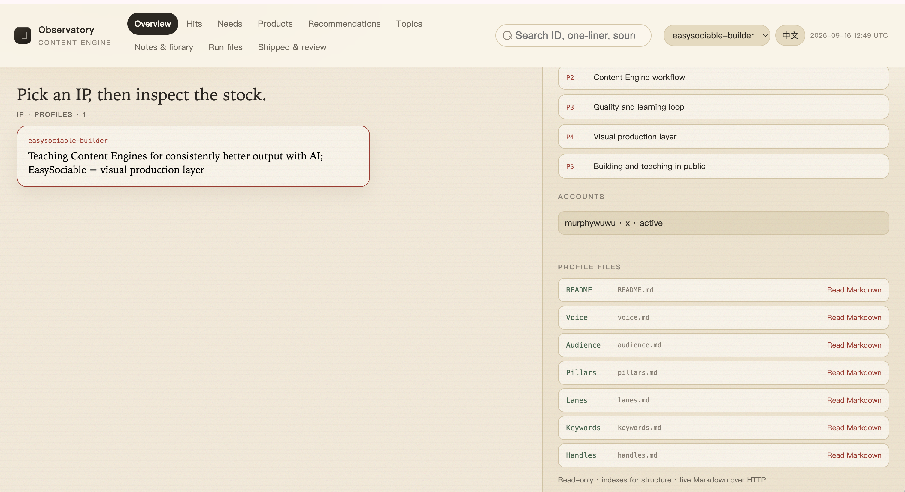
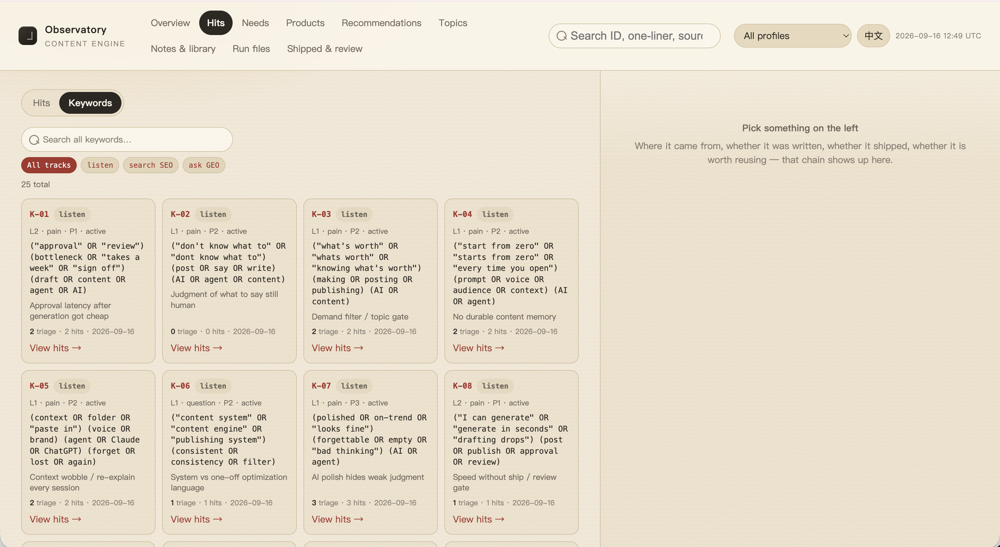
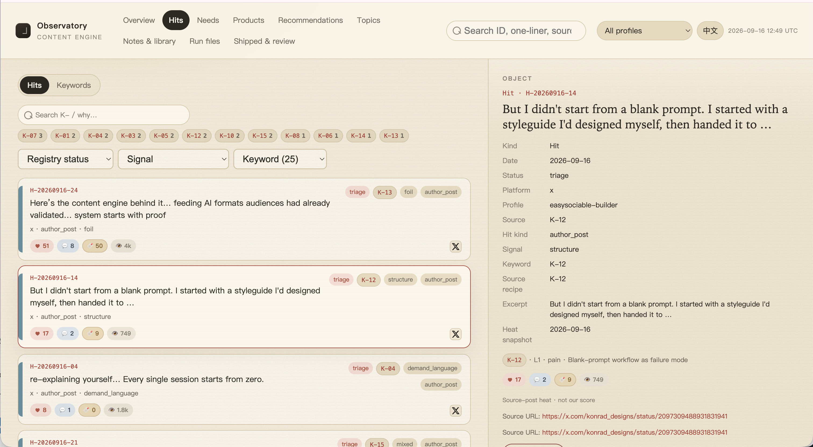
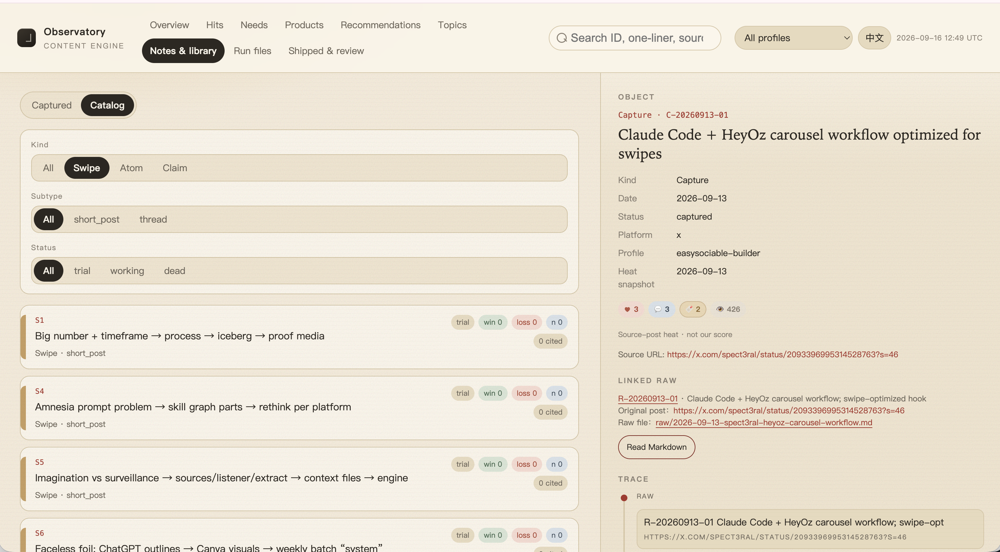
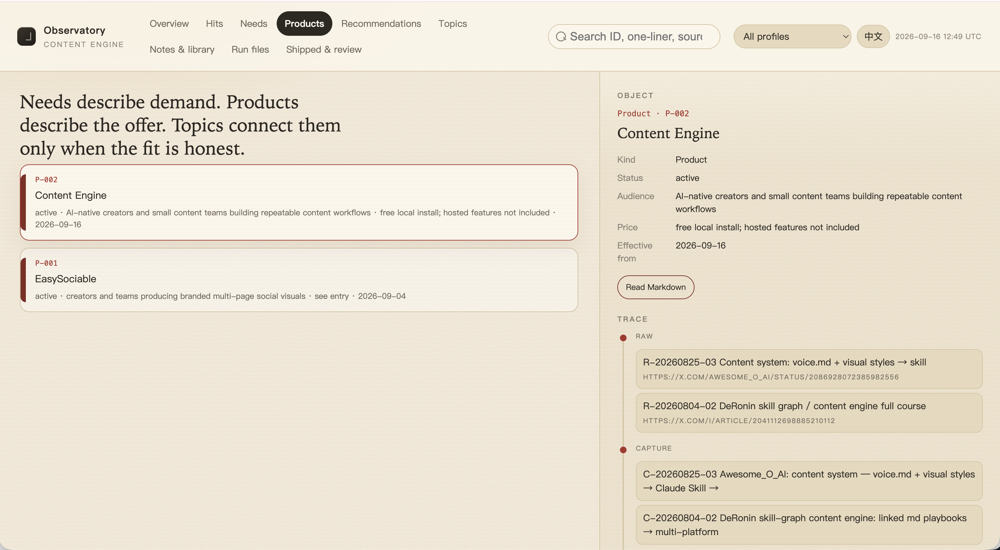
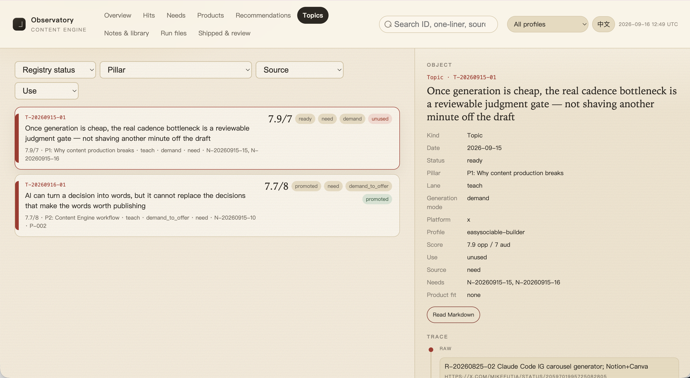
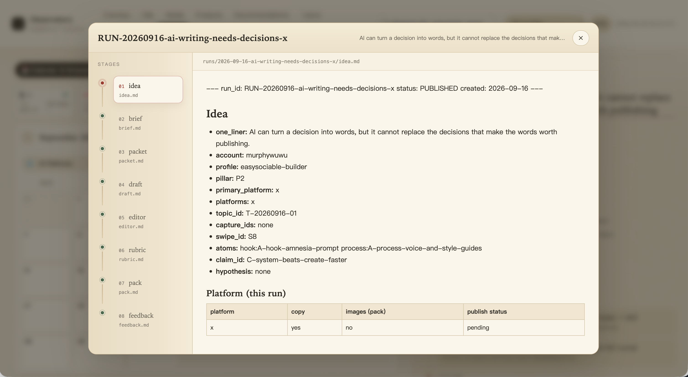
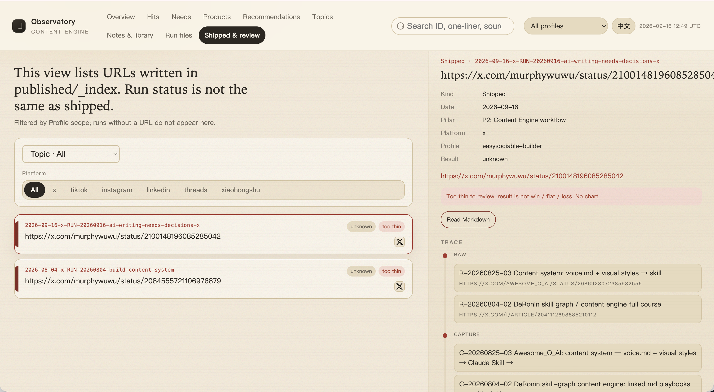

# Content Engine

Turn what your audience says into content worth publishing.

Content Engine helps your Agent move from real audience language to clear
topics, platform-specific drafts, and learning from published results.

You talk to your Agent. It stores the work in local Markdown files, while the
workbench gives you a visual view of how your content system grows.


## How it works



### 1. Understand your audience

Build your profile, collect real audience language, and study examples worth
learning from.

### 2. Choose what is worth saying

Turn audience evidence into a topic with a clear judgment, audience, and reason
to exist.

### 3. Create for one platform

Turn one topic into a platform-specific brief, draft, review, and publishable
package.

### 4. Publish and learn

Record what happened. Reuse structures and claims that work. Keep weak ideas
visible instead of pretending they worked.

## Built-in safeguards

Content Engine keeps the process grounded:

- Audience quotes stay verbatim.
- Topics are reviewed before drafts are created.
- Each platform gets its own run.
- Published results become evidence for future decisions.

## Install and start

### 1. Clone the Content Engine

```bash
git clone https://github.com/murphywuwu/content-engine.git
cd content-engine
```

This folder is your local Content Engine. Keep it private if it contains your
profile, audience research, drafts, or other private knowledge.

### 2. Install the EasySociable CLI and `easysociable-content` skill

Install the EasySociable CLI first, then install the Content skill:

```bash
curl -fsSL https://easysociable.com/install.sh | bash
easysociable install --skills content --yes
```

The first command installs the `easysociable` tool. The second installs the
`easysociable-content` skill for your Agent. The skill explains how to operate
the engine; `CLAUDE.md` in this folder remains the source of truth for this
specific engine.

You do not need to install Node.js packages, Python packages, a database, or a
separate workbench. The Agent handles the workbench when it is useful.

### 3. Tell your Agent what you want to do

Open the cloned folder in your Agent and follow the stages below.

## What to say, at a glance

You never operate the workbench directly. You say one short phrase, and the
workbench fills in as a read-only mirror.

| Say | And the Agent will |
| --- | --- |
| `interview me` | set up your creator profile |
| `set up my keywords` | generate pain / product / question keywords |
| `scan keywords` | search real platforms for audience language |
| `record these audience needs: <quotes>` | log quotes you already have |
| `capture this <link>` | deconstruct a post into your library |
| `scan needs for topics` | turn Needs into scored Topics |
| `open a run from T-xxx` | produce content for a chosen platform |
| `record this published post and its feedback: <url>` | close the learning loop |

## The engine, stage by stage

### Stage 1 — Profile: who is speaking

Say `interview me`.

Everything downstream is grounded in your profile, so this comes first. The
Agent interviews you one dimension at a time — identity, experience, voice,
values, boundaries, audience — and saves each answer before asking the next. It
will not invent biography, values, or boundaries; where it has nothing from
you, it writes an empty starter and asks.

Your profile drives voice, allowed topics, and the platform rules the Agent
applies later. Without boundaries and a few real Needs, the engine refuses to
produce drafts or images.

Workbench: your profile appears in the selector at the top right of the
**Overview** tab.



### Stage 2 — Keywords: how you go looking

Say `set up my keywords`.

Keywords are how you find real audience language when you do not have it yet.
The Agent proposes candidates from your profile — audience and pillars — and you
keep the ones that fit. Each keyword carries an intent:

- **pain** — phrases your audience uses when describing a problem
- **product** — terms for a product or category people discuss
- **question** — questions people ask about the topic

Pain keywords are searched on real platforms in the next stage. Product and
question keywords can carry an optional volume note if you have one.

Keywords live in your profile (`keywords.md`), so there is no separate workbench
tab — you will see the payoff in Hits and Needs after you scan. If you already
have real quotes, skip ahead and record them directly.



### Stage 3 — Scan, triage, and collect Needs

Say `scan keywords` to research, or `record these audience needs: <quotes>` to
log language you already have.

Scanning searches real platforms and stages every result in **Hits**, a triage
board — not your Needs. From Hits you route each item to one of three places:
a real Need, the craft library, or discard. This keeps noise out of your
evidence.

- Scanning uses the `agent-reach` skill, which lets your Agent reach
  Xiaohongshu, X, Reddit, and others — install it once from
  [Agent Reach](https://github.com/Panniantong/Agent-Reach)
  ([install guide](https://raw.githubusercontent.com/Panniantong/agent-reach/main/docs/install.md)).
- A **Need** is verbatim audience language only. The Agent will not turn a
  headline, a product claim, or an imagined pain into a fake quote.
- The graphics hard gate needs at least **three** Needs before any drafts or
  images.

Workbench: the **Needs** and **Hits** tabs.



### Stage 4 — Capture: deconstruct what already works

Say `capture this <link>` and paste a post or structure worth learning from.

Use this to break down someone else's hit. The Agent stores the source and its
structure so you can reuse the pattern later. On your approval, a capture can be
promoted into the **craft library**:

- **swipe** — a reusable post structure
- **atoms** — reusable parts: hook, reframe, proof, process, or call to action
- **claims** — propositions you can defend, each with its own evidence table

A capture is craft reference, not your own audience demand and not a finished
idea. The library never fills itself silently — every entry needs your yes.

Workbench: the **Notes & library** tab.



### Stage 5 — Products and Recommendations (optional)

Products and Recommendations give a topic something to point at, but they never
prove demand on their own.

- **Products** are offers you own. The Agent loads the cited entry before using
  any pricing, entitlement, or product claim — and never invents them.
- **Recommendations** are third-party tools or products you review or compare.
  They require evidence, research dates, limits, and commercial disclosure, and
  they are never treated as your own product.

A product claim is not an audience Need, and a vendor's marketing is not review
evidence. The engine keeps these strictly apart.

Workbench: the **Products** and **Recommendations** tabs.



### Stage 6 — Topics: decide what is worth saying

Say `scan needs for topics`.

The Agent reviews your captured Needs and proposes up to five Topics. A Topic is
not a title — it is a decision card you can read in a minute: who it is for, the
false belief it corrects, the core judgment, the timing, and the evidence gap.

Before writing a topic to "produce", the Agent asks which **generation mode**
fits your input rather than guessing:

- `demand` — Needs plus Profile
- `demand_to_offer` — Needs plus a Product
- `demand_to_review` — Needs plus a Recommendation
- `review` — a Recommendation with evidence
- `offer_education` — a Product and its mechanism
- `profile_thesis` — your Profile and a pillar

Each produced Topic is scored on five dimensions — context, audience, conflict,
insight, evidence. A Topic is only **ready** when the opportunity score and the
audience score both clear their bar. Popularity alone never makes a Topic ready.

Workbench: the **Topics** tab.



### Stage 7 — Runs: produce content for a platform

Say `open a run from T-xxx` (a topic id).

The Agent asks which platform to use first. Each platform is its own run with
its own craft rules, so a multi-platform request becomes separate runs sharing
one topic — never one draft reused everywhere.

Inside a run, the work moves through gates you approve:

1. **Brief** — a thesis, the reader's before/after belief, and named evidence.
   It is self-scored, and a weak brief is flagged before you ever see a draft.
2. **Draft** — written for this platform only, following its craft file.
3. **Editor** — revised against the platform's quality bar.
4. **Rubric** — a final score that decides ship or hold.

At each gate the Agent stops for your OK. It will not skip straight to a
finished post.

Workbench: the **Run files** tab.



### Stage 8 — Publish and close the learning loop

Say `record this published post and its feedback: <url / results>`.

The Agent records one row per shipped post and links it to its run — without
inventing metrics. This is where the loop closes:

- Every structure, atom, or claim you used gets its scoreboard updated (uses,
  wins, losses) — but only from real published results.
- A claim is promoted to "supported" only after several runs actually back it
  up **and** you approve. A single win is recorded, never celebrated.
- What failed stays visible in the feedback, so the next decision is better
  informed.

Workbench: the **Shipped & review** tab.



## Core and private vault

By default, this folder is both the engine core and your private vault:
`engine.json` uses `"vault_root": "."`.

| Part | Contains | Update policy |
| --- | --- | --- |
| Core | `CLAUDE.md`, rules, templates, indexes, and workbench code | Update from this repository |
| Vault | Your profile, Needs, captures & library, Topics, Runs, and published records | Keep private and back up |

If you want reusable engine rules separate from private data, point
`vault_root` in `engine.json` to another directory. See
[LAYOUT.md](./LAYOUT.md).

## If you already have an engine folder

If an existing folder contains both rules and private data, split it with:

```bash
python3 scripts/migrate-split-vault.py \
  --engine "/path/to/Content Engine" \
  --yes
```

## License

MIT — see [LICENSE](./LICENSE).
